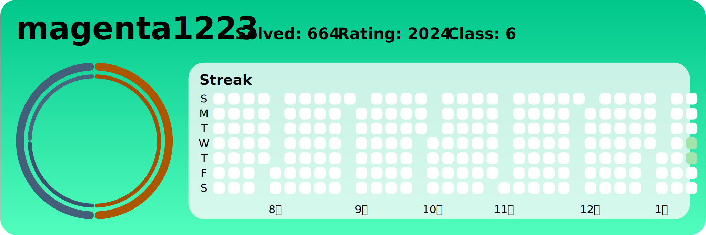

# BOJ-Archive 
 
## 날짜 순 정렬

    
문제 보기

| 번호 | 문제 번호 | 이름 | 링크 | 코드 | 날짜 |
| --- | --- | --- | --- | --- | --- |
| 0 | 1002 번 |  터렛 | [문제링크](https://boj.kr/1002) | [소스코드](./problems/1002번：%20터렛/1002번：%20터렛.py) | 2025-01-15 |
| 1 | 1037 번 |  약수 | [문제링크](https://boj.kr/1037) | [소스코드](./problems/1037번：%20약수/1037번：%20약수.py) | 2025-01-15 |
| 2 | 1001 번 |  A-B | [문제링크](https://boj.kr/1001) | [소스코드](./problems/1001번：%20A-B/1001번：%20A-B.py) | 2025-01-14 |
| 3 | 1000 번 |  A+B | [문제링크](https://boj.kr/1000) | [소스코드](./problems/1000번：%20A+B/1000번：%20A+B.py) | 2025-01-14 |

## 난이도 별 정렬

    
문제 보기

| 번호 | 문제 번호 | 이름 | 링크 | 코드 | 날짜 |
| --- | --- | --- | --- | --- | --- |
| 0 | 1002 번 |  터렛 | [문제링크](https://boj.kr/1002) | [소스코드](./problems/1002번：%20터렛/1002번：%20터렛.py) | 2025-01-15 |
| 1 | 1037 번 |  약수 | [문제링크](https://boj.kr/1037) | [소스코드](./problems/1037번：%20약수/1037번：%20약수.py) | 2025-01-15 |
| 2 | 1000 번 |  A+B | [문제링크](https://boj.kr/1000) | [소스코드](./problems/1000번：%20A+B/1000번：%20A+B.py) | 2025-01-14 |
| 3 | 1001 번 |  A-B | [문제링크](https://boj.kr/1001) | [소스코드](./problems/1001번：%20A-B/1001번：%20A-B.py) | 2025-01-14 |

## 시도했으나 못 푼 문제

    
문제 보기

| 번호 | 문제 번호 | 이름 | 링크 | 코드 | 날짜 |
| --- | --- | --- | --- | --- | --- |

